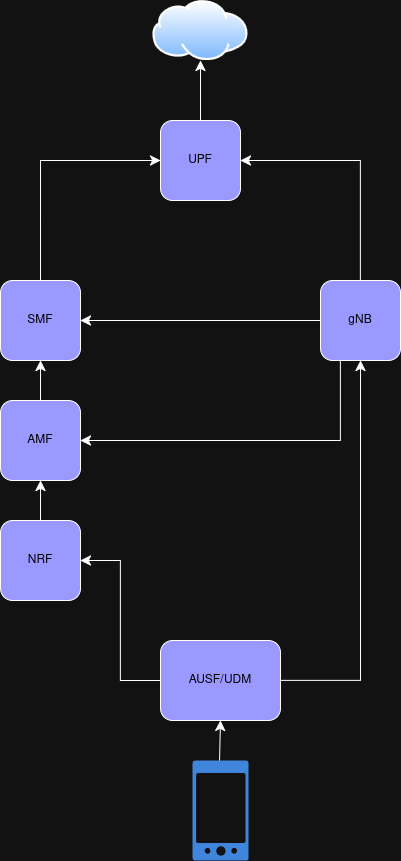

# Semaine du 17 au 21 juin 2025 — Documentation OpenAirInterface (5G SA)

## Objectif de la semaine

Comprendre et documenter l'architecture du système OpenAirInterface en mode 5G Standalone (SA), ainsi que la chaîne de connexion entre les différents composants réseau (UE, gNodeB, Core).

## Tâches réalisées

### 1. Étude de l'architecture OAI 5G SA

- Lecture de la documentation officielle OAI.
- Identification des composants principaux : UE, gNB, AMF, SMF, UPF, NRF, AUSF, UDM.
- Compréhension des interfaces : NR-Uu, NG, N3, N4, N11, N5/N8, Nnrf.

### 2. Schématisation

- Création d'un schéma clair représentant l’architecture 5G SA.
- Ajout des flèches entre les composants avec le nom des interfaces.
- Vérification du chemin complet entre un smartphone (UE) et Internet via le Core 5G.

### 3. Discussion technique

- Confirmation que cette architecture correspond bien à celle utilisée avec OpenAirInterface.
- Application pratique avec le matériel à disposition (modem Quectel, USRP si applicable).

## Schéma produit

Un schéma a été généré pour illustrer le fonctionnement de la 5G SA avec OpenAirInterface. Celui-ci peut être intégré dans le rapport sous forme d’image ou lien :

### Schéma Architecture OAI 5G SA

## Résultats

- Bonne compréhension des composants et de leurs interactions.
- Prêt à configurer les services OAI sur les machines dédiées (gNodeB, AMF, UPF, etc.).
- Documentation prête à être intégrée dans le rapport de stage ou wiki technique.

---

## Référence

> [site_utilisé](https://openairinterface.org/oai-5g-core-network-project/)

*Rédigé par :* Kopethan  
*Encadré par :* M. Labiod

